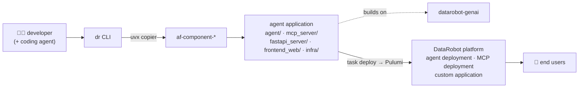

  

<h2 align="center">DataRobot OSS</h2>

  <a href="https://datarobot.com">Homepage</a>
  ·
  <a href="https://docs.datarobot.com">Documentation</a>
  ·
  <a href="https://af.datarobot.com">App Framework Docs</a>
  ·
  <a href="https://docs.datarobot.com/en/docs/get-started/troubleshooting/general-help.html">Support</a>

  

## DataRobot Open Source Software (OSS)

Welcome to [DataRobot](https://datarobot.com)'s open source home! 👋

Here you'll find open-source software from our Research &amp; Development and Customer-Facing teams — the tools, scripts, and libraries we use to build and work with DataRobot ourselves, shared back with the community.

> **Disclaimer:** these are first-party open-source repositories, provided as-is with no official support.

## Where to start

| If you want to… | Go here |
| --- | --- |
| Scaffold, run, and deploy a DataRobot app from your terminal | [`cli`](https://github.com/datarobot-oss/cli) — the `dr` CLI |
| Give your coding agent (Claude Code, Cursor, Codex, Gemini CLI, Copilot) DataRobot skills | [`datarobot-agent-skills`](https://github.com/datarobot-oss/datarobot-agent-skills) |
| Build an agentic application | [Agent Framework](#-the-agent-framework) ↓ · [af.datarobot.com](https://af.datarobot.com) |
| Stand up the cloud infrastructure DataRobot runs on | [AWS](https://github.com/datarobot-oss/terraform-aws-dr-infra) · [Azure](https://github.com/datarobot-oss/terraform-azurerm-dr-infra) · [Google Cloud](https://github.com/datarobot-oss/terraform-google-dr-infra) |
| Wire DataRobot into your CI/CD | [`github-actions`](https://github.com/datarobot-oss/github-actions) · [`workload-deploy-github`](https://github.com/datarobot-oss/workload-deploy-github) |

## DataRobot on GitHub

DataRobot's code is spread across four GitHub organizations. Which one you want depends on what you're doing:

| Organization | What lives there |
| --- | --- |
| [**datarobot**](https://github.com/datarobot) | DataRobot, Inc.'s primary organization. Home of our flagship public projects — [datarobot-user-models](https://github.com/datarobot/datarobot-user-models) (DRUM, the custom model runtime), [syftr](https://github.com/datarobot/syftr) (agentic workflow optimizer), and [dr-apps](https://github.com/datarobot/dr-apps) (host custom apps without building an image) |
| [**datarobot-oss**](https://github.com/datarobot-oss) | 📍 *You are here.* First-party open source from our R&amp;D and customer-facing teams: the `dr` CLI, agent and GenAI runtime libraries, Terraform modules, GitHub Actions, and application templates. |
| [**datarobot-community**](https://github.com/datarobot-community) | Community-facing building blocks: [Foundational AI Application Templates](https://docs.datarobot.com/en/docs/workbench/wb-apps/app-templates/index.html), the [App Framework](https://af.datarobot.com) and its `af-component-*` modules, and the declarative API ([Pulumi](https://github.com/datarobot-community/pulumi-datarobot) / [Terraform](https://github.com/datarobot-community/terraform-provider-datarobot) providers). Some content here is contributed by the user community and may need adjusting for your environment. |
| [**datarobot-forks**](https://github.com/datarobot-forks) | Forks of third-party open source we depend on, where we stage changes to send upstream. Nothing here is DataRobot-developed or supported. |

Agentic application work in particular spans `datarobot-oss` (runtime libraries and the CLI) and `datarobot-community` (the components and templates you compose) — the next section maps out how the pieces fit together.

## 🧩 The Agent Framework

The **App Framework** (docs: [af.datarobot.com](https://af.datarobot.com)) is a code-first way to build an agentic application and ship it to DataRobot. Rather than one monolithic template, you compose small [copier](https://copier.readthedocs.io/) components — the `af-component-*` repos — into a project, then deploy it with a single task.

**How the flow works**

1. **Scaffold.** A developer — often working alongside a coding agent loaded with [`datarobot-agent-skills`](https://github.com/datarobot-oss/datarobot-agent-skills) — runs the [`dr` CLI](https://github.com/datarobot-oss/cli), which composes `af-component-*` modules with `copier`.
2. **Compose.** Components render into a project such as [`datarobot-agent-application`](https://github.com/datarobot-community/datarobot-agent-application), producing an `agent/` package plus whatever backend, frontend, MCP server, and Pulumi infrastructure you asked for.
3. **Build.** The generated agent runs on the [`datarobot-genai`](https://github.com/datarobot-oss/datarobot-genai) runtime library, routes model calls through the DataRobot LLM Gateway (or an LLM deployment / NIM of your choosing), and pulls tools from the MCP server it was built with.
4. **Deploy.** `dr task deploy` runs Pulumi — [`datarobot-pulumi-utils`](https://github.com/datarobot-oss/datarobot-pulumi-utils) over the [`pulumi-datarobot`](https://github.com/datarobot-community/pulumi-datarobot) provider — which provisions the agent as a custom model and serverless deployment, plus the MCP server and the chat application.
5. **Use.** End users talk to the deployed application, which streams the conversation to and from the agent deployment.

### The components

Each component is a copier template with declared dependencies, so `base` is always applied first and the rest layer on top. Components marked *repeatable* can be applied more than once (two MCP servers, three LLMs, and so on).

| Component | What it adds |
| --- | --- |
| [af-component-base](https://github.com/datarobot-community/af-component-base) | The foundation every App Framework project needs — project scaffolding, task wiring, and the shared answer file downstream components read. Applied first, exactly once. |
| [af-component-agent](https://github.com/datarobot-community/af-component-agent) | The agentic core. Scaffolds an `agent/` package for your chosen framework — **LangGraph**, **CrewAI**, **LlamaIndex**, **NVIDIA NeMo Agent Toolkit**, or a plain base agent — and wires in `datarobot-genai` with the matching extras. |
| [af-component-llm](https://github.com/datarobot-community/af-component-llm) | Configures the models your app calls: the DataRobot LLM Gateway, or a deployed LLM the other components then use. Infrastructure-only, repeatable. |
| [af-component-datarobot-mcp](https://github.com/datarobot-community/af-component-datarobot-mcp) | A [Model Context Protocol](https://modelcontextprotocol.io) server — a FastMCP application with DataRobot tools built in — deployed on its own so agents can call it. Repeatable. |
| [af-component-fastapi-backend](https://github.com/datarobot-community/af-component-fastapi-backend) | A FastAPI backend deployed as a DataRobot Custom Application. Deliberately minimal, so you own the surface. Repeatable. |
| [af-component-react](https://github.com/datarobot-community/af-component-react) | A React single-page frontend layered onto a FastAPI backend component, bundled into the deployed application. |
| [scaffold-af-component](https://github.com/datarobot-community/scaffold-af-component) | GitHub template for building your *own* `af-component-*` repo — copier config, template tree, tasks, and CI already set up. |
| [app-framework](https://github.com/datarobot-community/app-framework) | The tooling and documentation for applying and updating components, plus the App Framework skill pack for coding assistants. |

### The runtime pieces (here in `datarobot-oss`)

| Repository | Role in an agentic app |
| --- | --- |
| [datarobot-genai](https://github.com/datarobot-oss/datarobot-genai) | The library the generated agent is built on: a framework-agnostic agent base with per-framework wrappers, a unified LLM router (Gateway, LLM deployment, NIM, or external provider), the serving front-end that exposes an OpenAI-style streaming endpoint, the MCP server framework, and OpenTelemetry tracing plus moderation. |
| [datarobot-pulumi-utils](https://github.com/datarobot-oss/datarobot-pulumi-utils) | Pulumi component resources and typed argument schemas on top of the `pulumi-datarobot` provider — custom model deployments, LLM blueprints, execution environments. |
| [cli](https://github.com/datarobot-oss/cli) | The `dr` CLI that drives scaffolding, local dev, and deploy. |
| [datarobot-agent-skills](https://github.com/datarobot-oss/datarobot-agent-skills) | Skills that let a coding agent do all of the above on your behalf. |

## Repositories

Jump to a category:

- [🤖 AI Agents &amp; Coding Skills](#-ai-agents--coding-skills)
- [🧠 GenAI &amp; Model Serving](#-genai--model-serving)
- [⌨️ CLI &amp; Developer Tools](#️-cli--developer-tools)
- [🏗️ Install &amp; Infrastructure](#️-install--infrastructure)
- [🔁 CI/CD &amp; Automation](#-cicd--automation)
- [🚀 Application Templates &amp; Samples](#-application-templates--samples)
- [🔌 Integrations](#-integrations)

### 🤖 AI Agents &amp; Coding Skills

Bring DataRobot into your AI coding agents, and build agentic systems you can trust.

| Repository | Description |
| --- | --- |
| [datarobot-agent-skills](https://github.com/datarobot-oss/datarobot-agent-skills) | Skills that bring DataRobot platform capabilities — training, deployment, predictions, monitoring, explainability — to Claude Code, Cursor, Codex, Gemini CLI, and Copilot. |
| [datarobot-agent-tester](https://github.com/datarobot-oss/datarobot-agent-tester) | Generate, test, and improve `AGENTS.md` files and AI coding skills via the DataRobot LLM Gateway. |

### 🧠 GenAI &amp; Model Serving

| Repository | Description |
| --- | --- |
| [datarobot-genai](https://github.com/datarobot-oss/datarobot-genai) | The runtime library for building generative and agentic AI applications on DataRobot. See [the Agent Framework](#-the-agent-framework) above. |
| [datarobot-fastrag](https://github.com/datarobot-oss/datarobot-fastrag) | Async-native FastAPI runner for DataRobot custom LLM and RAG models — drop-in compatible with existing DRUM `custom.py` hooks, with much higher throughput for I/O-bound LLM workloads. |

### ⌨️ CLI &amp; Developer Tools

| Repository | Description |
| --- | --- |
| [cli](https://github.com/datarobot-oss/cli) | The DataRobot command-line interface (`dr`) — scaffold projects, manage components, run tasks, and deploy. |
| [homebrew-taps](https://github.com/datarobot-oss/homebrew-taps) | Homebrew tap housing DataRobot's binary casks for easy installation on macOS. |
| [drgithelper](https://github.com/datarobot-oss/drgithelper) | Git credentials helper binary used by DataRobot Notebooks. |

### 🏗️ Install &amp; Infrastructure

Provision and deploy the infrastructure DataRobot runs on.

| Repository | Description |
| --- | --- |
| [terraform-aws-dr-infra](https://github.com/datarobot-oss/terraform-aws-dr-infra) | Terraform module for the base infrastructure required to run DataRobot on AWS. |
| [terraform-azurerm-dr-infra](https://github.com/datarobot-oss/terraform-azurerm-dr-infra) | Terraform module for the base infrastructure required to run DataRobot on Azure. |
| [terraform-google-dr-infra](https://github.com/datarobot-oss/terraform-google-dr-infra) | Terraform module for the base infrastructure required to run DataRobot on Google Cloud. |
| [datarobot-pulumi-utils](https://github.com/datarobot-oss/datarobot-pulumi-utils) | Pulumi component resources and utilities built on top of the `pulumi-datarobot` provider. |
| [helm-datarobot-plugin](https://github.com/datarobot-oss/helm-datarobot-plugin) | Helm plugin providing DataRobot-specific chart tooling, including air-gapped image handling. |

### 🔁 CI/CD &amp; Automation

Reusable automation for building, deploying, and governing DataRobot workloads.

| Repository | Description |
| --- | --- |
| [github-actions](https://github.com/datarobot-oss/github-actions) | Open-source GitHub Actions used across DataRobot repositories. |
| [workload-deploy-github](https://github.com/datarobot-oss/workload-deploy-github) | GitHub Action that deploys any repo with a `.datarobot.yaml` manifest to a DataRobot Workload, building the image server-side. |
| [custom-models-action](https://github.com/datarobot-oss/custom-models-action) | GitHub Action to manage custom inference models and deployments through CI/CD workflows. |
| [review-router](https://github.com/datarobot-oss/review-router) | GitHub Action that routes code reviews based on `CODEOWNERS`. |
| [copier-template-validator](https://github.com/datarobot-oss/copier-template-validator) | Action for App Framework components: reads specs, resolves dependencies, and renders templates. |
| [cve-sync](https://github.com/datarobot-oss/cve-sync) | Propagates and enforces curated Python dependency CVE floors and overrides across repositories — the constraints package metadata can't carry on its own. |

### 🚀 Application Templates &amp; Samples

Ready-to-use starters for building custom applications on DataRobot. For agentic applications, start with [the Agent Framework](#-the-agent-framework) instead.

| Repository | Description |
| --- | --- |
| [react-base-app](https://github.com/datarobot-oss/react-base-app) | Base template for a Node.js + React custom application. |
| [streamlit-app-base](https://github.com/datarobot-oss/streamlit-app-base) | Ready-to-use Streamlit application template for rapid custom app development. |
| [flask-app-base](https://github.com/datarobot-oss/flask-app-base) | Ready-to-use Flask application template for rapid custom app development. |
| [slack-bot-app](https://github.com/datarobot-oss/slack-bot-app) | Ready-to-use Slack bot template for rapid custom app development. |
| [golang-app](https://github.com/datarobot-oss/golang-app) | Sample Go custom application. |
| [qa-app-streamlit](https://github.com/datarobot-oss/qa-app-streamlit) | Sample question-and-answer Streamlit application. |
| [yourself-as-a-service](https://github.com/datarobot-oss/yourself-as-a-service) | The "as a service" sample app behind our LinkedIn/YouTube demos. |

### 🔌 Integrations

| Repository | Description |
| --- | --- |
| [mlops-sap-integration](https://github.com/datarobot-oss/mlops-sap-integration) | Templates and environments for integrating DataRobot MLOps with SAP AI Core. |

## Get involved

- 💬 Join the conversation in [`#all-datarobot-community`](https://join.slack.com/t/datarobot-community/shared_invite/zt-3uzfp8k50-SUdMqeux25ok9_5wr4okrg) on Slack.
- 🐛 Found a bug or have an idea? Open an issue on the repository in question.
- 📚 Product documentation lives at [docs.datarobot.com](https://docs.datarobot.com); App Framework documentation at [af.datarobot.com](https://af.datarobot.com).
